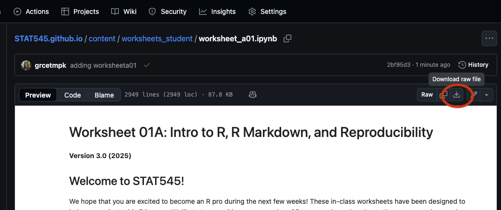

## Worksheets

Blank worksheets as `.ipynb` and `.zip` files can be found here!

You can download worksheets by clicking the download button on the top right-hand side of the worksheet preview:

Download and save them in a folder on your personal computer so that you can access them through Jupyter notebooks. 

Worksheets (.ipynb file) are submitted for grading on Canvas.
