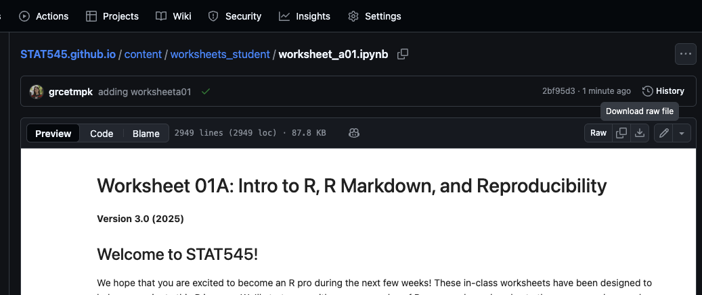

## Worksheets

Blank worksheets as `.ipynb` and `.zip` files can be found here!

You can download worksheets by clicking the download button on the top right-hand side of the worksheet preview:

{width="500"}

Save them in a folder and access them through Jupyter notebooks. Submit the worksheet (.ipynb file) on Canvas.
