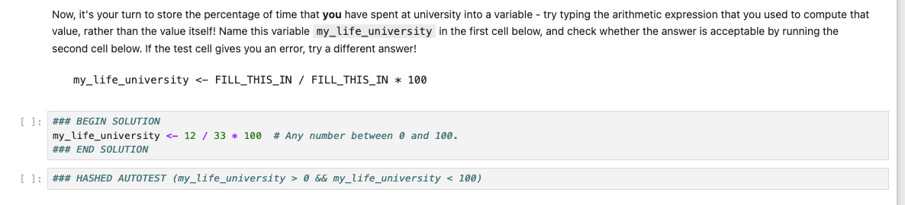
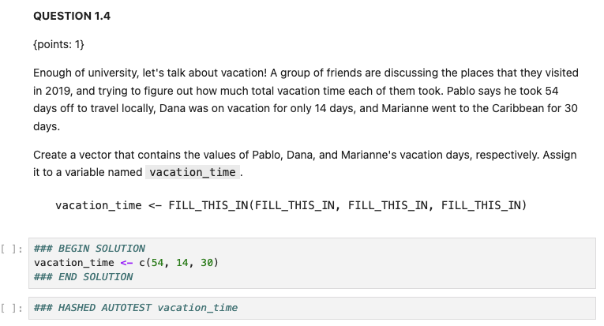

## Worksheets

These instructions assume you have Jupyter/Anaconda installed as per the student instructions

Summary of Resources:

-   <https://ttimbers.github.io/jupyter-nbgrader-r/slides/jupyter-nbgrader-r.html#7>

-   <https://github.com/ttimbers/jupyter-nbgrader-r>

-   <https://github.com/UBC-STAT/stat-545-instructor/blob/master/instructor-guides/autograding_worksheets.md>

Pre-requisites:

-   Set up Jupyer/Anaconda as per the student instructions

-   Download and Install Docker Desktop, if you don’t already have it (<https://www.docker.com/products/docker-desktop/>)

-   Launch Docker Desktop and create an account

------------------------------------------------------------------------

## Copying Worksheets from Instructor Repo

1.  Clone the instructor repo to your local machine (mine’s on desktop as Jupyter cannot access OneDrive?)

    ```         
    git clone <https://github.com/UBC-STAT/stat-545-instructor.git> /path/to/destination
    ```

2.  Open the worksheet (for example, \*\*worksheet_a01.ipynb) in Jupyter notebooks from the `worksheets/source` folder. These worksheets are written WITH solutions.

3.  Edit the worksheet and save (more on this below)

------------------------------------------------------------------------

## Editing Existing Worksheets

### Editing text cells

Some cells are read only. To temporarily enable editing, go to EDIT \> EDIT NOTEBOOK METADATA. Go to COMMON TOOLS and you should be able to change cells to “Editable”, then back to “Read Only”. At a minimum you should update the version number if making changes. Click the play button to view it normally again.

### The Autotest System

The autotest system automatically checks student answers in Jupyter Notebooks using tests specified in \*\*autotests.yml. It’s designed to work with nbgrader to support large-scale grading.

Solutions are written in the Jupyter Notebook wrapped between:

```         
### BEGIN SOLUTION
answer0.1a ← your_answer_here
### END SOLUTION
```

Then, in another code chunk in the Jupyter notebook, we perform the autotest.

Key Command: `### HASHED AUTOTEST`

-   This special comment is placed at the top of a test code cell to indicate what the autotest should evaluate

-   You can also test multiple answers in one line using semicolons

-   Answers are hashed which makes them less obvious to students

Example: `### HASHED AUTOTEST answer0.1_A; answer0.1_B; answer0.1_C`

-   The expression can contain any valid R expression which you wish to test

-   Here we test that answers_0.1 A through C are equivalent to the solutions

-   Multiple conditions are separated by semicolons

Example: `### HASHED AUTOTEST length(answer1.1)`

-   tells autotest to evaluate the length of the student’s answer rather than the answer itself. In the student notebook, it will compute length(answer1.1) and compare the result to the expected length from the solution notebook.

Autotest does the following:

-   checks the type of the response (e.g., string, list, numeric) and runs the corresponding tests defined in the autotest.yml file for that type.

-   It compares the response against the expected value defined in the instructor’s solution notebook, using multiple stages of validation as specified in the autotest.yml file.

-   If the answer is incorrect, the student will receive an autogenerated error message based on the failed test criteria in the autotest.yml file.

-   Autotest runs tests in the order they are defined in the YAML file. This layered approach allows for more detailed checks and provides more specific feedback when a student’s answer is incorrect.

All the test rules live in the autotest.yml file.

-   You can edit or add to this file

-   Predefined test types include: string, numeric, list, dataframe, ggplots

Full example:

{alt="Screenshot 2025-08-09 at 1.16.18 PM.png"}

**Some notes on autograder tests**

-   When writing a test that uses `sort()` on a character vector that contains special characters, the behaviour/ouput will depend on the user's locale, which is also OS-dependent. Stripping away special characters with something like `gsub("[[:punct:]]", "", x)` before `sort()` can address this.

###  Assigning Values for Grading

Values for each question are assigned using `{points: X}` where `X` is the value for the question. See below for an example in the instructor version with solutions (worksheets/source/worksheet_a01)



------------------------------------------------------------------------

## Generate a Version with Tests and Solutions

This generates a student facing version including the tests that will be performed, but also includes the answer for easy debugging.

Navigate to the worksheets folder in the stat-545-instructor repo (using `cd` command), and run the following code

```         
nbgrader generate_assignment --source_with_tests --force worksheet_a01
```

Open the folder in stat-545-instructor/worksheets/source_with_tests/ and you will see a new notebook that has answers AND runnable tests. Run all cells to ensure it works properly.

Tips: debug more by checking that you also get fails for wrong answers. You can also submit this to canvas under “student view” to generate a test submission for your autograder

------------------------------------------------------------------------

## Creating Student Facing Versions

1.  Open Powershell (Windows) or Terminal (Mac OS). Navigate to the worksheets folder in the stat-545-instructor repo (i.e, `cd Desktop/stat-545-instructor/worksheets`), and run the following code in your shell/terminal to "refresh the exchange directory":

    ```         
    # remove existing directory, so we can start fresh for demo purposes
    rm -rf /tmp/exchange

    # create the exchange directory, with write permissions for everyone
    mkdir /tmp/exchange
    chmod ugo+rw /tmp/exchange
    ```

2.  Add the worksheet to database.db file by running:

    ```         
    nbgrader db assignment add worksheet_aXX
    ```

    -   if you get an error that nbgrader is not found, install it first using `pip install nbgrader` and then rerun the above code.

3.  Generate the student version of (say) worksheet_05a by running (**TIP, you need to be in the directory that contains the file nbgrader_config.py file**):

    ```         
    nbgrader generate_assignment --force worksheet_aXX
    ```

4.   Take a look in the worksheets/release/ folder -- your outputted assignment should be there!

5.  Add a new assignment to canvas for this worksheet (you'll have to click on the "More Options" button when you go to create an assignment):

    -   Under the description write: “Please upload your Worksheet 5-A file here -- it should be a .ipynb file named worksheet_aXX”.

    -   Points: use the number of questions they need to get correct in order to get full points.

    -   Change the "submission type" to "File Uploads"; then, click "Restrict Upload File Types", and enter `ipynb`

    -   Input the Due Date

    -   Click "Save and Publish".

------------------------------------------------------------------------

## Autograding Worksheets

Follow Steps A - E for the autograding workflow. We assume Docker Desktop has already been installed.

**A. Start Docker Container**

1.  Open **Docker Desktop** and ensure it’s running (on Mac you will see a whale icon by the Bluetooth button on the top of your screen, and when you click it it should say docker is running)

2.  Open a terminal window. Navigate to stat-545-instructor folder (parent directory) (i.e., and run Docker build

    ```         
    cd Desktop/stat-545-instructor #change to your destination
    docker build . -t nbgrader -f worksheet_dockerfile/Dockerfile
    ```

3.  Go to the worksheets (i.e., the folder containing the nbgrader_config.py file) and run a Docker container with the following command:

    ```         
    cd worksheets

    docker run --rm -p 8888:8888 \\
      -v "${PWD}":/mnt/nbgrader_root \\
      --name nbgradercontainer \\
      nbgrader:latest
    ```

    -   This will show the link (third one works for me) to use to connect to the Jupyter web interface. You can minimize this Terminal window but ***DO NOT*** **close it. You do not need to open any links.** In another terminal, you can run `jupyter server list` to see the URLs of running servers with their tokens.

4.  **Open a new terminal window.** Attach a terminal to the new container with

    ```         
    docker exec -it nbgradercontainer /bin/bash. 
    ```

    From now on, this terminal will be the main point of interaction with nbgrader! We will call this Terminal A. After running the command, you should see
    `(base) jovyan@xxxxxxxxxx:~$`

5.  The home directory in this Docker container is the same directory as worksheets/

6.  To move things "into the Docker container", you will move them to the corresponding directories in worksheets/

7.  Within the Docker container, you will not be able to access anything outside of worksheets/

8.  In Terminal A: type `ls -l` to view a detailed list of what’s in your directory

    -   You might need to create some directories in worksheets/ so that they exist in the Docker container if anything is missing

    -   If anything is highlighted in red, you can try to remove them and then call `mkdir`.

```         
total 4
lrwxrwxrwx 1 jovyan users   32 Aug 11 19:48 autotests.yml -> /mnt/nbgrader_root/autotests.yml
lrwxrwxrwx 1 jovyan users   28 Aug 11 19:48 canvas.py -> /mnt/nbgrader_root/canvas.py
lrwxrwxrwx 1 jovyan users   29 Aug 11 19:48 downloaded -> /mnt/nbgrader_root/downloaded
lrwxrwxrwx 1 jovyan users   31 Aug 11 19:48 gradebook.db -> /mnt/nbgrader_root/gradebook.db
lrwxrwxrwx 1 jovyan users   25 Aug 11 19:48 grades -> /mnt/nbgrader_root/grades
lrwxrwxrwx 1 jovyan users   37 Aug 11 19:48 nbgrader_config.py -> /mnt/nbgrader_root/nbgrader_config.py
lrwxrwxrwx 1 jovyan users   26 Aug 11 19:48 release -> /mnt/nbgrader_root/release
lrwxrwxrwx 1 jovyan users   25 Aug 11 19:48 source -> /mnt/nbgrader_root/source
drwsrwsr-x 2 jovyan users 4096 Oct 20  2023 work
```

-   If you need to create some directories, you can create these directories in worksheets/, using another separate Terminal window (a.k.a. Terminal B) `mkdir grades; mkdir downloaded`

-   If you need the autograder to have access to files, edit the Dockerfile in worksheets_dockerfile/ (i.e., it needs the autotest.yml file)

**B. Prepare for Submissions**

*This step only needs to be done the first time you grade!*

We need to import Student IDs from Canvas

1.  Export the gradebook for STAT545 as a CSV file (under Grades in Canvas). Save the unmodifed version in the grading/ folder.

2.  Open the CSV and remove all but the ID and Student column.

3.  Rename the “ID” column to “id” and rename the “Student” column to “student”

4.  Delete the second row. Save as students.csv in worksheets/

    -   Because you are using **save as**, there will now be two versions of the Canvas gradebook CSV file

        -   Original: DATE_Grades-STAT_545A_101.csv. MOVE THIS TO grading/

        -   Modified: students.csv (should already be in worksheets/

5.  Run the following command in Terminal A:

    ```         
    nbgrader db student import /mnt/nbgrader_root/students.csv
    ```

**C. Gather Submissions**

1.  After the deadline, download student submissions from Canvas.

2.  Move the ZIP file (submissions.zip) into the folder downloaded/{assignment_id}/archive.

    -   You will need to make these 3 nested folders in worksheets/ to be able to access them within the Docker container, for example (in Terminal B):

    -   Within the worksheets/ folder, make folders for the following path: downloaded/{assignment_id}/archive manually or by:

    ```         
    mkdir -p downloaded/{assignment_id}/archive && mv ~/Downloads/submissions.zip downloaded/{assignment_id}/archive
    ```

3.  Ensure that the file [canvas.py](http://canvas.py) is in the worksheet directory and that the nbgrader_config.py file contains the following lines:

    `# Only collect submitted notebooks with valid names  c.ZipCollectApp.strict = True`

4.  Within the Docker container  (Terminal A) run

```         
nbgrader generate_assignment --force {assignment_id} 
```

for example: `nbgrader generate_assignment --force worksheet_a02`.

-   It doesn't matter if you've run `nbgrader generate_assignment` in the past to generate the student-facing version of the worksheet-- it must be run *again* within the Docker container or you will encounter issues.

5.  In Terminal A: collect the submissions:

```         
nbgrader zip_collect --collector=canvas.CanvasPlugin {assignment_id}
```

for example `nbgrader zip_collect --collector=canvas.CanvasPlugin worksheet_a02`.

-   add `-- force` if file already exists to overwrite it

**D. Run the Autograder**

1.  To ensure the assignment is added to nbgrader and the notebook generated, run in Terminal A:

```         
nbgrader db assignment list
```

You should see something like:

`worksheet_a02 (due: None)  # <-- assignment "worksheet_a02" is available     - worksheet_a02        # <-- a notebook called "worksheet_a02" is made`

If the assignment is not listed, add it with `nbgrader db assignment add {assignment_id}` (Terminal A), and then generate the assignment with `nbgrader generate_assignment --force {assignment_id}` (Terminal A). If you encounter any issues about the notebook already being associated with submissions, delete the submissions within each student ID, and re-gather them using `nbgrader zip_collect --collector=canvas.CanvasPlugin {assignment_id}` (Terminal A).

2.  Run autograding with (Terminal A):

```         
nbgrader autograde {assignment_id}
```

3.  Export grades with

```         
nbgrader export
```

-   This creates a file grades.csv with the students' canvas ID and the points for this one worksheet (although the other worksheets are present as well, they can be ignored).

4.  Move this file to the grades directory:

```         
mv grades.csv grades/grades_{assignment_id}.csv
```

Otherwise it will be lost when the Docker container is terminated.

-   IMPORTANT: Make sure there is no whitespace after the .csv name!

-   Now you should see the grades_worksheet_axx.csv file in your local grades folder.

**E. Publish scores**

1.  Open a new Terminal window (Terminal B). `cd` to stat-545-instructor/grading/ directory.

2.  Use the file grading/compile_nbgrader_grades.R to compile the grades from nbgrader to a Canvas-readable CSV format. Navigate to the grading/ directory and run the script (Terminal B):

    ```         
    Rscript compile_nbgrader_grades.R {raw_canvas_grades.csv} {assignment_id}
    ```

    -   This script will merge the nbgrader grades and the existing grades from Canvas to the {raw_canvas_grades.csv}, and the output will be canvas.csv in worksheets/grades.

    -   If for some reason the csv is not opening properly, check that there is no white space after the .csv exenstion. If problem still persists, open Excel, go to File \> Import \> import from CSV and find the grades_worksheet_a01.csv file. Import it in cell A1. Save as csv and overwrite the original.

<!-- -->

3.  Verify that the scores are correct.

    -   Check a few random assignments to ensure grading is correct
    -   **WARNING**: if you had multiple versions of the worksheet circulating, the autograder will run into issues with cell metadata not matching, etc. These worksheets will be given a score of 0, so make sure that you check that all the 0's are *actually* 0's and not because of differing worksheet versions. **Avoid circulating multiple versions of worksheets**, or make sure that students are only submitting the newest version (that corresponds to the instructor version of the worksheet). Let the students know that adding extra cells in their notebook will cause issues with the autograder.

4.  Upload the file worksheets/grades/canvas.csv to the "grades" page by clicking on "Actions" \> "Import"

**Troubleshooting tips**

-   The autograder grades students in id order, and terminates at the first error.

-   Common fixable errors include duplicating cells (fixable by going into the worksheet in the submitted folder and deleting the cells) and changing chunk types (e.g. from a code chunk to a text chunk).

-   

------------------------------------------------------------------------

## Pushing Changes to Github

-   optional: create your own branch `git checkout -b newbranchname`

-   add changes: `git add .`

-   commit changes: `git commit -m “edits to worksheet aXX"`

-   push: `git push origin master` or `git push origin <newbranchname`\>
