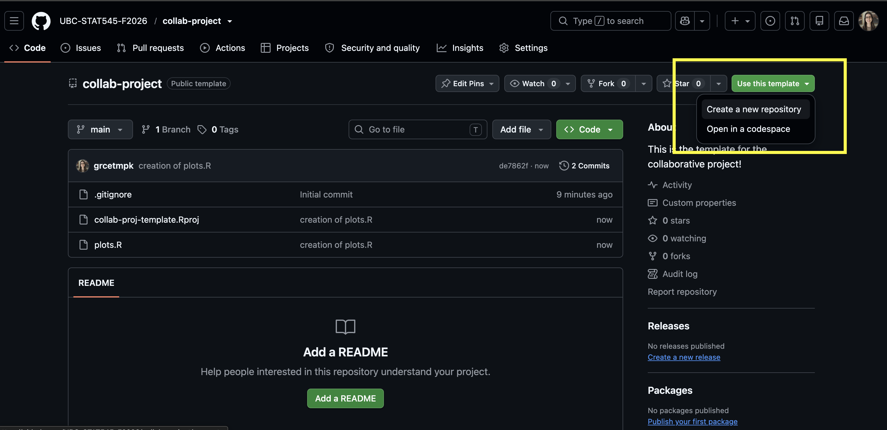
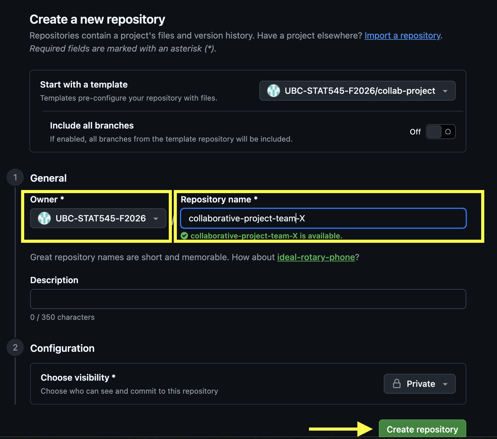

[**Due October 01, 2026 at 11:59pm PT**]{.underline}

**Points**: 85

## Welcome to the Collaborative Project!

By completing this project, students are expected to be able to collaborate on a project using the git + GitHub workflow.

::: callout-warning
Before beginning, ensure [have sent Grace your GitHub username on Canvas!](https://canvas.ubc.ca/courses/193398/assignments/2518781)
:::

::: callout-important
**Read through the project in its entirety** to ensure you've made a plan for all of the components to be completed! Many tasks are not "standalone". You'll need to decide in advance who does what!

A few other things to note:

-   We will be grading the organization and files of your repository, your communication, and the commit history

-   Deductions may be made for continually pushing to `main`. You should only be pushing to your branch

-   A full grading rubric can be found on \[Canvas\]()<https://canvas.ubc.ca/courses/193398/assignments/2518773>)

-   It is okay to go back a redo exercises, and have more commits - just provide a commit message of what has changed.
:::

## Exercise 1: Getting Set Up \[5 points\]

We will be assigning students to teams randomly. Team assignments are on Canvas and can be viewed in the People \> Collaborative Assignment section.

For both collaborative project milestones, you’ll be working with your teammate(s) on the same GitHub repository (or “repo”). One person in the team will need to make the repository; the other(s) can then join that repo.

**1.1** Create a Group Chat on our Slack Team with all of your members in it (see Canvas for the link to join Slack if you haven't already done so)

**1.2** Have one group member make a copy of the template repository. To do this:

-   Navigate to [the template repository in our UBC-STAT-545-F2026 Organization](https://github.com/UBC-STAT545-F2026/collab-project)

-   Click "Use this template" and select "Create a new repository"

    

-   Change the owner to UBC-STAT545-F2026 and name your repository "collaborative-project-team-X" where X is your group number from Canvas.

-   Keep your repository private and click "Create Repository".

{fig-align="center" width="500"}

**1.3** That same group member must now add their teammates to the repository as collaborators. To do this:

-   Go to your repository’s homepage (https://github.com/UBC-STAT545-F2026/collaborative-project-team-x)

-   Go to “Settings” -\> “Collaborators and Team”

-   Click "Add People"

-   Input one teammate’s GitHub username (you’ll have to do one at a time).

-   When asked to “choose a role”, click “Admin” (because each teammate should have full access to the repository).

-   Make sure you’ve added everyone in your team.

*You may also see additional people having access to your repository, these are the TAs + Instructor! This is by design.*

**1.4** Everyone should create a branch with their GitHub username as the branch name.

**1.5** Everyone should clone the GitHub repository to their local machines, and ensure they are working on their individual branches (not `main`).

-   Note: if you forgot to make a new branch before cloning, you can also create a branch after the fact within RStudio!

## Exercise 2: GitHub Issues \[10 points\]

GitHub Issues are a useful way to communicate with your team. They should be used for messages about your project that deserve some permanence and reference.

Examples of messages that might belong on GitHub Issues:

-   “I noticed a problem with how we worked on Milestone 1. How can we go about fixing these?”

-   “Here are my ideas for things to include in the README file – do you have any other ideas?”

-   Meeting agendas

Your task in this milestone is to introduce yourself in a GitHub Issue:

**2.1** Each team member should write a new Issue introducing themselves briefly with their name, program, and a note on whether or not they are new to Github. Tag (\@username) each of your teammates in the body of your Issue.

**2.2** Each team member should respond to everyone’s introduction Issue.

## Exercise 3: Teamwork Contract \[10 points\]

Whenever you embark on a project with a team, it’s always a good idea to establish a teamwork contract so that you can establish your expectations and get the team on the same page. This should be a living document – your team should revisit the teamwork contract as you establish a better or more realistic way of working together.

**3.1** Have one person make a new Markdown (not RMarkdown) document in the root of your repository called `TEAMWORK.md` (on their local machines and on their own branch).

**3.2** Have the same person fill in the document with guidelines as to how you will work together. You can communicate through Slack to decide on the details. Be sure to include the following sections (with a second-level (##) header):

-   **Division of Labour**: How will you divide the work required for this milestone? Read through the project and figure out who does what tasks/exercises. Be as specific as possible.

-   **Timing**: When will you each aim to submit your pull requests, keeping in mind that another teammate will need to review your work? *Warning: Do not submit your part of the project last-minute. Your teammate’s review of your work may not be trivial: if there are errors, your team will need time to debug them.*

-   **Communication**: How will you communicate with each other? For example, will you be using both Slack and GitHub Issues? For what, exactly? How long will it realistically take you to respond to a message? Will you hold a regular meeting, or rely exclusively on asynchronous communication?

**3.3** The same person saves, stages, and commits these changes. **The commit message should read "initial update of TEAMWORK.md (ex 3)"**.

**3.4** The same person pushes the changes to their branch (not `main`).

**3.5** The same person should open a Pull Request on GitHub. In your pull request, include a comment and title indicating (at a high level) what this change is about.

**3.6** A different person should now review and approve the pull request on GitHub with a brief comment ("Looks good!" is sufficient).

All members should then pull the changes from `main` to their own branch.

## Exercise 4: Create a README \[10 points\]

**4.1** Another member (different from the one who created the `TEAMWORK.md` file) should create a README **markdown** (not RMarkdown!) file (named exactly `README.md`). This file should be written in Markdown style with the following:

-   A header titled "Collaborative Project"

-   A brief description of the this project and its purpose

-   A sub-header titled "Files"

-   A brief description of any files/folders in the project (you will have the opportunity to update this again later after exploring more files, so just add what you can now)

**4.2** The same person saves, stages, and commits these changes. **The commit message should read "initial update of README.md (ex 4)"**

**4.3** The same person pushes the changes to their branch (not `main`).

**4.4** A different person (ideally not the one who reviewed the last pull request) should now review and approve the pull request on GitHub, leaving a brief comment.

All members should then pull the changes from `main` to their own branch.

## Exercise 5: Elevating the Teamwork Contract and README \[20 points\]

**5.1** Someone other than the person who created the `TEAMWORK.md` and `README.md` files (if possible) should now edit these files locally. While still on your personal branch, run `git pull origin main` to pull in the changes your other teammates made.

**5.2**

-   Update your `TEAMWORK.md` file to include at least one [task list](https://docs.github.com/en/get-started/writing-on-github/working-with-advanced-formatting/about-tasklists)

-   Update your `TEAMWORK.md` file to mention/tag all of your teammates (either individually or through a single team mention)

-   Include a clickable hyperlink to the course website in either your `TEAMWORK.md` or `README.md` file.

-   Create a new folder called `img`. Save a photo (can be a random photo from the internet) to this folder and include the image in either your `TEAMWORK.md` or `README.md` file.

-   Include a bullet point list of files in your `README.md`, which shows the contents and describes of ALL folders and files in your repository. Use backtick quotations (\`like this\`) to format your file and folder names `like this`. For example:

    -   The following folders/files are in this Repository:

    -   `analysis.R`: R code to run my main analysis

    -   `README.md`: the README file for this repository

    -   `NOTES.md`: research notes for the `analysis.R` file

    -   `secondary`: a folder for secondary analysis which contains:

        -   `sensitivityanalysis.R`: an R file running a sensitivity analysis
        -   `plots.R`: an R file used to produce plots for my paper
        -   `README.md`: a second-level README file describing the contents of the `secondary` folder

    -   `resources`: a folder containing relavent papers for the analysis.

        -   `tompkins2026.pdf`: a paper on logistic regression by Tompkins (2026)
        -   `tompkins2024.pdf`: a paper on linear regression by Tompkins (2024)

The [GitHub Markdown Guide](https://docs.github.com/en/get-started/writing-on-github/getting-started-with-writing-and-formatting-on-github/basic-writing-and-formatting-syntax#task-lists) and [RMarkdown Cheatsheet](https://rstudio.github.io/cheatsheets/html/rmarkdown.html) will help you in this exercise.

**5.3** The same team member should push their changes and create a Pull Request, as in Exercises 3 and 4. **The commit message should read "updating TEAMWORK.md and README.md (ex 5)"**

**5.4** A different person should now review and approve the pull request on GitHub, leaving a brief comment.

All members should then pull the changes from `main` to their own branch.

## Exercise 6: Fixing Merge Conflicts \[15 points\]

In this exercise, your team will create and fix a merge conflict.

**6.1** Two members (A and B) will update the same line of the `plots.R` file found in the repository.

-   Working on their own branch, Member A will change line 17 from `ggtitle("CHANGE THIS TITLE")` to `ggtitle("Analysis of mtcars")`.

-   Working on their own branch, Member B will change line 17 from `ggtitle("CHANGE THIS TITLE")` to `ggtitle("Motor Trends Data Visualization")`.

**6.2** Member A will stage, commit, and push the changes. **The commit message should read "member A changing plot title (ex 6.2)"**. Member A will also open a pull request, **but do not approve it yet**.

**6.3** Member B will stage, commit, and push the changes. **The commit message should read "member B changing plot title (ex 6.3)"**. Member B will also open a pull request, **but do not approve it yet**.

**6.4** Member C will first approve and merge Member A's pull request.

**6.5** Member C will then look at Member B's pull request and see a conflict message. Member C will then resolve the conflict **within GitHub (edit the file on GitHub)** to have the title "Motor Trends Data Visualization". Click "Mark as Resolved" and then "Commit Merge". **The commit message should read "resolving merge conflict for plot title (ex 6.5)"**

**6.6** Any group member will then refresh the Pull Request on GitHub and merge it with `main`.

## Exercise 7: Tidying Up \[12 points\]

As a team, review the project and ensure that your repository is clean and organized. Check the following:

-   Are all files organized?

-   Are any "relic" files leftover (i.e., maybe you accidentally knit something to a pdf and that pdf is not needed but still showing up in your files)?

-   Does your `README.md` file accurately reflect and describe ALL files in your repository?

-   Have all completed tasks been checked off (i.e., \[x\]) in your `TEAMWORK.md` file?

-   Are all changes reflected on `main`?

-   Do all Markdown files render properly when viewed on GitHub?

If not, as a team work together to ensure all of these are met. *Remember, all work should be done on your individual branch and then merged to `main`!* If you need to make changes, you should indicate briefly what changes have been made and **include "(ex 7)" in your commit message**.

## Exercise 8: Submitting this Milestone \[3 points\]

To submit this Milestone, you’ll be tagging a release on your GitHub repository, and adding a link to the release on canvas.

*How to tag a release*:

1.  Navigate to the main page (root) of your collaborative GitHub repository.

2.  There should be a small link on the right-hand-side of your page that says “Create a new release”. Click that.

-   You might also be able to get to the same place by clicking on the “tags” link beside where your branches are listed.

3.  For the tag version, put `1.0`

-   Choose a release title and description (this is less important).
-   Do **not** check off “This is a pre-release”.
-   Click “Publish Release”.
-   Put a link to that release as a submission on the Collaborative Project on Canvas (only one member needs to do this).

*If you want to “re-tag” your release*:

If you want to change your submission *after* tagging a release, you can still do this if it’s before the deadline. Just increase the secondary version number by one – so, make the tag version `1.1`, then `1.2`, etc.

## Attribution

Thanks to Icíar Fernández Boyano for coming up with much of the ideas behind this collaborative project.
